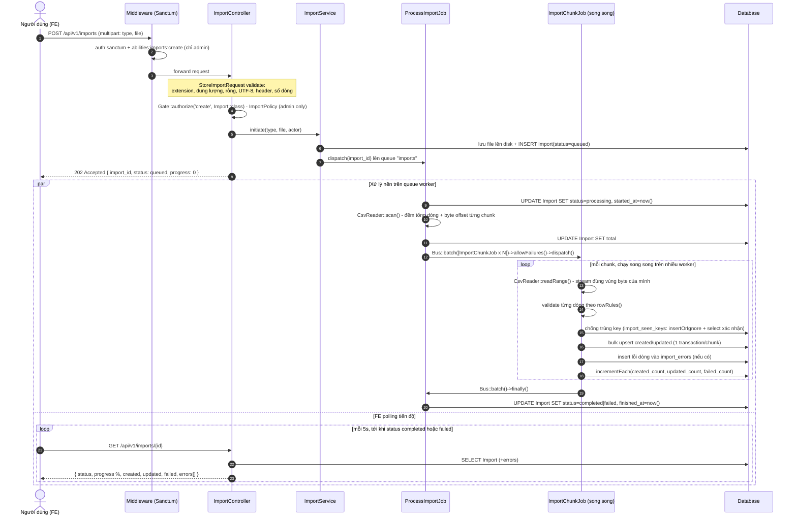
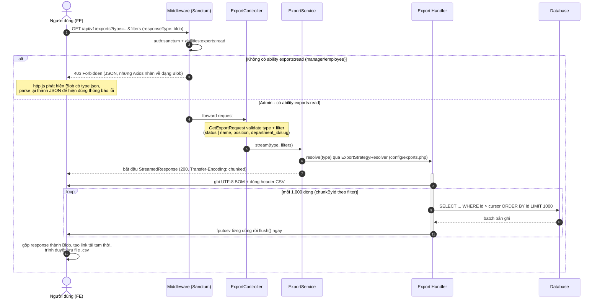
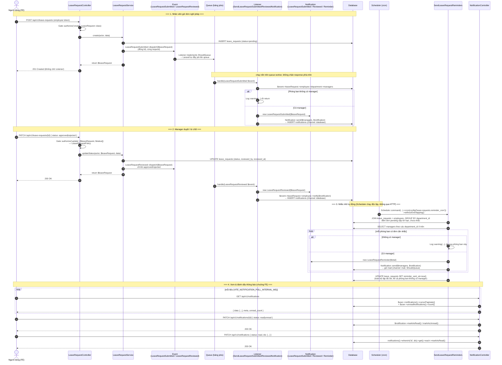

# Department Management

Hệ thống quản lý phòng ban và nhân sự: RESTful API viết bằng Laravel 13 (PHP 8.4), xác thực bằng Sanctum (token abilities theo vai trò), kèm hai chức năng CSV đặc biệt — **import hàng loạt chạy nền (queue)** và **export streaming đồng bộ** — cùng một SPA React (Vite) làm giao diện người dùng.

## Mục lục

- [Kiến trúc](#kiến-trúc)
- [Chức năng chính](#chức-năng-chính)
- [Phân quyền](#phân-quyền)
- [Import CSV hàng loạt (chạy nền qua queue)](#import-csv-hàng-loạt-chạy-nền-qua-queue)
- [Export CSV (streaming đồng bộ)](#export-csv-streaming-đồng-bộ)
- [Thông báo đơn nghỉ phép (Events, Notifications, Scheduler)](#thông-báo-đơn-nghỉ-phép-events-notifications-scheduler)
- [Điểm hay / đáng chú ý](#điểm-hay--đáng-chú-ý)
- [Cấu trúc thư mục](#cấu-trúc-thư-mục)
- [Yêu cầu hệ thống](#yêu-cầu-hệ-thống)
- [Hướng dẫn cài đặt & chạy](#hướng-dẫn-cài-đặt--chạy)
- [Chạy test](#chạy-test)
- [Tài liệu API](#tài-liệu-api)

## Kiến trúc

- **Backend**: Laravel 13, PHP 8.4. Toàn bộ API nằm dưới `routes/api.php`, namespace `App\Http\Controllers\Api\V1`.
- **Auth**: Laravel Sanctum — đăng nhập bằng email/password trả về personal access token, mỗi token được gắn **abilities** tương ứng với vai trò (`admin` / `manager` / `employee`) tại thời điểm cấp token (`App\Services\AuthService::abilitiesFor()`).
- **Authorization**: Laravel Policies (`DepartmentPolicy`, `EmployeePolicy`, `ImportPolicy`) kết hợp với middleware `abilities:<ability>` áp riêng cho từng action của `apiResource` (`->middlewareFor()`).
- **Import (async)**: Upload file → lưu file + tạo bản ghi `Import` (status `queued`) → dispatch job lên queue (`ProcessImportJob`) → job chia file thành các chunk và dispatch `Bus::batch()` các `ImportChunkJob` chạy song song trên nhiều queue worker → mỗi chunk tự parse, validate, upsert theo transaction riêng, ghi lỗi từng dòng vào `import_errors`, chống trùng key trong cùng 1 lần import bằng bảng `import_seen_keys`.
- **Export (sync streaming)**: Client gọi `GET /api/v1/exports` → handler đọc DB theo chunk (`chunkById`) → ghi CSV trực tiếp vào `php://output` và flush sau mỗi batch → trình duyệt nhận file qua `StreamedResponse`, memory server ổn định O(1) bất kể số dòng.
- **Frontend**: SPA React 19 + Vite (`fe/vite-project`), gọi API qua Axios, dùng `react-router-dom` cho routing và Context API cho auth state — độc lập hoàn toàn với Laravel views/Inertia (project scaffold có sẵn Inertia nhưng không được dùng ở phần frontend thực tế này).
- **Queue/Job store**: mặc định dùng `database` queue driver — không cần cài Redis để chạy được, chỉ cần `php artisan queue:work`.
- **DB**: MySQL (khuyến nghị cho production, vì các cơ chế khoá/atomic upsert được thiết kế và kiểm chứng cho InnoDB), test suite mặc định chạy trên SQLite in-memory để nhanh và không phụ thuộc môi trường.

## Chức năng chính

- **Quản lý Phòng ban** (`/api/v1/departments`): CRUD đầy đủ, slug tự động, soft delete, trạng thái `active`/`inactive`.
- **Quản lý Nhân viên** (`/api/v1/employees`): CRUD đầy đủ, gắn với phòng ban, vai trò (`employee`/`manager`/`admin`), ngày sinh, soft delete, index tối ưu cho tìm kiếm theo tên và lọc theo vai trò.
- **Xác thực** (`/api/v1/auth`): đăng nhập, lấy thông tin bản thân (`me`), đăng xuất (thu hồi token hiện tại).
- **Import hàng loạt bằng CSV** (`/api/v1/imports`): import phòng ban hoặc nhân viên từ file CSV, xử lý bất đồng bộ, theo dõi tiến độ và lỗi theo từng dòng qua endpoint `show`.
- **Export ra CSV** (`/api/v1/exports`): xuất phòng ban hoặc nhân viên ra file CSV theo đúng bộ lọc đang áp dụng trên trang danh sách, tải về ngay trong 1 request (không cần polling).
- **Đơn nghỉ phép** (`/api/v1/leave-requests`): nhân viên gửi đơn, manager duyệt/từ chối đơn trong phòng ban mình, admin toàn quyền mọi trạng thái/phòng ban.
- **Thông báo** (`/api/v1/notifications`): mỗi lần gửi/duyệt đơn tự động tạo thông báo qua Events + Queued Listeners; nhắc nhở qua email mỗi ngày cho đơn còn tồn đọng (Scheduler); xem/đánh dấu đã đọc qua REST API riêng, hiển thị trên chuông thông báo ở FE.

## Phân quyền

Vai trò nhân viên (`position`): `admin`, `manager`, `employee`. Xem chi tiết ở [auth-business-rules.md](auth-business-rules.md).

| | Admin | Manager | Employee |
|---|---|---|---|
| **Phòng ban** | Full CRUD | Xem danh sách/chi tiết; chỉ sửa được phòng ban của mình | Chỉ đọc |
| **Nhân viên** | Full CRUD, gán phòng ban, đổi vai trò | Xem/tạo/sửa nhân viên trong phòng ban của mình; không xoá, không đổi vai trò | Xem danh sách; chỉ xem/sửa hồ sơ của chính mình |
| **Import** | Toàn quyền tạo & xem import | Không có quyền | Không có quyền |
| **Export** | Toàn quyền xuất CSV | Không có quyền | Không có quyền |
| **Đơn nghỉ phép** | Toàn quyền, mọi phòng ban, mọi trạng thái (kể cả revert về `pending`) | Xem đơn phòng ban mình; duyệt/từ chối đơn đang `pending` trong phòng ban mình | Tạo đơn cho mình; xem/huỷ đơn đang `pending` của chính mình |
| **Thông báo** | Xem & đánh dấu đã đọc thông báo của mình | Xem & đánh dấu đã đọc thông báo của mình | Xem & đánh dấu đã đọc thông báo của mình |

Việc phân quyền được thực hiện ở 2 lớp:

1. **Token abilities** (Sanctum) — giới hạn ngay từ lúc cấp token, ví dụ `manager` không bao giờ có ability `employees:delete`. `admin` là vai trò duy nhất được cấp `['*']`, nên cũng là vai trò duy nhất có `imports:*`/`exports:read`.
2. **Policy** (`DepartmentPolicy`, `EmployeePolicy`, `ImportPolicy`, `LeaveRequestPolicy`) — kiểm tra logic nghiệp vụ chi tiết hơn (VD: manager chỉ sửa được phòng ban của chính họ, employee chỉ xem/sửa hồ sơ của chính mình; riêng `ImportPolicy` chặn tuyệt đối mọi vai trò khác `admin` bất kể ability). Riêng **Thông báo** không có Policy riêng — quyền sở hữu được ép ngay trong query (`$request->user()->notifications()`), nên một user không thể nào truy vấn ra thông báo của người khác để mà cần kiểm tra quyền thêm.

## Import CSV hàng loạt (chạy nền qua queue)

Chỉ `admin` được tạo và xem import — thực thi qua Sanctum ability `imports:create`/`imports:read` **và** `ImportPolicy` (chặn tuyệt đối phía sau ability, xem [Phân quyền](#phân-quyền)). Chi tiết đầy đủ: [batch_processing_requirements.md](batch_processing_requirements.md), [csv_reader_explains.md](csv_reader_explains.md), [import_concurrency_strategy.md](import_concurrency_strategy.md).

### Luồng xử lý

1. Client gọi `POST /api/v1/imports` (multipart file + `type` = `department`|`employee`). `StoreImportRequest` kiểm tra phần mở rộng, dung lượng, file rỗng, mã hoá UTF-8, đúng header cột và tổng số dòng — mọi bước đều đọc file theo kiểu stream, không load hết vào bộ nhớ.
2. File được lưu vào disk, bản ghi `Import` tạo với `status=queued`, trả về `202 Accepted` ngay lập tức — **không xử lý file inline trong request**, tránh timeout với file lớn (tối đa 100.000 dòng/file).
3. `ProcessImportJob` (chạy trên queue worker) dùng `CsvReader::scan()` để đếm tổng số dòng và ghi lại byte-offset của từng chunk trong 1 lượt đọc duy nhất, rồi chia thành các `ImportChunkJob` theo `IMPORT_CHUNK_SIZE` (mặc định 1000 dòng/chunk) và dispatch đồng loạt bằng `Bus::batch()`. Mỗi job chỉ mang theo byte range (không mang dữ liệu dòng) nên payload luôn nhỏ, bất kể file lớn cỡ nào.
4. Nhiều `ImportChunkJob` chạy **song song** trên nhiều queue worker. Mỗi job xử lý 1 chunk trong 1 transaction: parse đúng vùng byte của mình, validate từng dòng, chống trùng key trong cùng 1 lần import bằng bảng `import_seen_keys` (unique constraint + `insertOrIgnore`), rồi `upsert()` atomic theo business key (VD: `slug` cho Department) — chỉ ghi những dòng thực sự mới hoặc có thay đổi. Dòng lỗi được ghi vào `import_errors` kèm nội dung dòng gốc, không làm rớt cả chunk.
5. Job có cấu hình `$tries`/`backoff` tăng dần (5s, 10s, 15s, 30s, 60s) để tự phục hồi khi gặp lock-wait/deadlock hiếm gặp giữa các import chạy đồng thời (xem phân tích trong `import_concurrency_strategy.md`).
6. Khi toàn bộ batch hoàn tất (`Bus::batch()->finally()`), `Import.status` chuyển sang `completed` hoặc `failed` (`failed` chỉ khi *toàn bộ* dòng trong file đều lỗi — còn lại luôn là `completed`, kể cả khi có lỗi một phần), `finished_at` được ghi nhận.
7. Client theo dõi tiến độ bằng cách poll `GET /api/v1/imports/{import}` mỗi 5 giây (xem `ImportDepartmentsModal`/`ImportEmployeesModal` ở FE) — trả về `status`, `progress` (%), `total`, `processed`, `created`, `updated`, `failed`, và danh sách lỗi theo dòng khi đã có.

### Sequence diagram



Cấu hình import nằm ở [config/imports.php](config/imports.php), điều khiển qua biến môi trường: `IMPORT_ALLOWED_EXTENSIONS`, `IMPORT_MAX_FILE_SIZE_MB`, `IMPORT_MAX_RECORDS`, `IMPORT_CHUNK_SIZE`, `IMPORT_QUEUE`, `IMPORT_MAX_RETRY`, `IMPORT_TIMEOUT`.

## Export CSV (streaming đồng bộ)

Chỉ `admin` được export — thực thi qua Sanctum ability `exports:read` (xem [Phân quyền](#phân-quyền)). Kiến trúc cố tình mirror Import (Strategy + Template Method) nhưng chạy **đồng bộ trong 1 request**, không qua queue: export chỉ là `SELECT` rồi format ra CSV, không có rủi ro ghi sai dữ liệu nên không cần chunk-job hay bảng theo dõi trạng thái phức tạp như import. Chi tiết quyết định kiến trúc: [export_plan.md](export_plan.md).

### Luồng xử lý

1. Client gọi `GET /api/v1/exports?type=department|employee&<filters>` kèm token — FE gọi với `responseType: 'blob'` vì response là file nhị phân, không phải JSON.
2. `GetExportRequest` validate `type` và bộ lọc theo đúng loại: `status` (`active`/`inactive`/`all`) cho Department; `name`, `position` (nhiều giá trị cách nhau bởi dấu phẩy), `department_id`/`department_slug` cho Employee.
3. `ExportService::stream()` tra `ExportStrategyResolver` để lấy đúng Handler theo `type` (`config/exports.php`), rồi trả về ngay một `StreamedResponse` — HTTP response bắt đầu gửi (`Transfer-Encoding: chunked`) trước khi toàn bộ CSV được tạo xong.
4. Bên trong callback stream, Handler (`AbstractExportHandler::writeTo()`) ghi UTF-8 BOM (để Excel hiển thị đúng tiếng Việt có dấu) + dòng header, sau đó đọc DB theo từng batch 1.000 bản ghi bằng `chunkById()` (áp đúng filter của loại export), ghi từng dòng bằng `fputcsv()` rồi `flush()` ngay — server chỉ giữ 1 batch trong bộ nhớ tại một thời điểm, memory ổn định O(1) bất kể bảng có bao nhiêu dòng.
5. Trình duyệt nhận CSV, FE gom lại thành `Blob`, tạo link tải tạm thời để trình duyệt lưu file — tên file sinh ở FE (`{type}s_export_{timestamp}.csv`), không đọc header `Content-Disposition` từ server vì `config/cors.php` chưa expose header đó cho phía client.
6. Nếu người gọi không phải admin, middleware `abilities:exports:read` chặn ngay ở tầng Sanctum (403), không tới Controller/DB. Vì FE gọi với `responseType: 'blob'`, body lỗi JSON cũng bị Axios trả về dưới dạng `Blob` — interceptor trong `http.js` tự nhận diện và parse lại thành JSON để hiện đúng thông báo lỗi thay vì "Something went wrong".

Cột CSV xuất ra trùng với `headers()` của Import Handler tương ứng (VD: Department cùng `name, slug, description, status`), nên **file export có thể import lại nguyên vẹn**.

### Sequence diagram



Cấu hình export nằm ở [config/exports.php](config/exports.php), điều khiển qua biến môi trường `EXPORT_CHUNK_SIZE` (mặc định 1000 — số dòng đọc từ DB mỗi batch).

### Lưu ý khi deploy production (Nginx)

Vì export là 1 `StreamedResponse` dài, flush theo từng chunk, cần chỉnh 2 nhóm cấu hình ở tầng Nginx khi lên production, nếu không client sẽ không nhận được dữ liệu tăng dần như thiết kế (hoặc bị cắt kết nối giữa chừng với file lớn):

- **Buffering**: mặc định Nginx bật `fastcgi_buffering`/`proxy_buffering`, tức là đọc *toàn bộ* response từ PHP-FPM rồi mới gửi cho client — vô hiệu hoá hết các lệnh `flush()` trong `AbstractExportHandler::writeTo()`. `ExportService::stream()` đã set sẵn header `X-Accel-Buffering: no` (Nginx tôn trọng header này per-response, không cần sửa nginx.conf), nhưng nếu có quyền chỉnh config trực tiếp, nên set thêm `fastcgi_buffering off;` trong 1 `location` block riêng cho `/api/v1/exports` (không set global, để không mất lợi ích buffer cho các API JSON khác) — phòng trường hợp có proxy/CDN khác đứng trước Nginx strip mất header.
- **Timeout**: `set_time_limit(0)` trong code chỉ tắt giới hạn của PHP, không ảnh hưởng tới `fastcgi_read_timeout`/`send_timeout` của Nginx (mặc định 60s) hay `request_terminate_timeout` của PHP-FPM pool — cả ba đều có thể cắt kết nối giữa chừng với export lớn và cần tăng riêng cho route này (nên set theo thời gian xử lý tệ nhất của **1 chunk**, không phải tổng thời gian export, vì timeout được reset mỗi lần flush).

```nginx
location = /api/v1/exports {
    fastcgi_buffering off;
    fastcgi_read_timeout 300s;
    try_files $uri /index.php?$query_string;
}
```

## Thông báo đơn nghỉ phép (Events, Notifications, Scheduler)

Mọi nhân viên/manager/admin đều có thể xem và quản lý thông báo của chính mình — thực thi qua Sanctum ability `notifications:read`/`notifications:update` (xem [Phân quyền](#phân-quyền)). Kiến trúc cố tình tách phần **nghiệp vụ** (`LeaveRequestService` — tạo/duyệt đơn) khỏi phần **side effect** (ai được thông báo, thông báo bằng cách nào) bằng lớp Event + Listener ở giữa: Service chỉ dispatch 1 Event, không biết và không cần biết có Listener nào đang lắng nghe hay không.

### Luồng xử lý

1. **Gửi đơn** — `LeaveRequestService::create()` insert `leave_requests` rồi `LeaveRequestSubmitted::dispatch($leaveRequest)` **ngay trong request** (dispatch Event luôn đồng bộ ở Laravel). Vì `SendLeaveRequestSubmittedNotification` có `implements ShouldQueue`, Laravel tự động đẩy job xử lý Listener này lên queue thay vì chạy luôn — response `201` trả về ngay, không chờ.
2. **Trên queue worker** (`php artisan queue:work`), Listener load `$leaveRequest->employee->department->managers` (quan hệ mới `Department::managers()`) rồi `Notification::send($managers, new LeaveRequestSubmitted($leaveRequest))` (channel `database`) — thông báo xuất hiện ngay trên chuông FE của manager. Nếu phòng ban không có manager, Listener chỉ `Log::warning()` rồi bỏ qua, không làm lỗi job.
3. **Duyệt / từ chối** — `LeaveRequestService::updateStatus()` cập nhật `status`, rồi chỉ khi kết quả là `approved`/`rejected` (không phải `cancelled` hay revert `pending`) mới `LeaveRequestReviewed::dispatch($leaveRequest)`. Listener `SendLeaveRequestReviewedNotification` gửi `Notification::LeaveRequestReviewed` (channel `database`) thẳng tới nhân viên sở hữu đơn.
4. **Nhắc nhở tự động mỗi ngày** — Scheduler (`routes/console.php`) chạy `leave-requests:send-reminders` theo lịch cấu hình trong `config('leave-requests.reminder_cron')`. Command **gom nhóm theo phòng ban** (`JOIN employees` + `GROUP BY department_id` + `COUNT`) để đếm số đơn `pending` sắp tới `start_date` (trong `config('leave-requests.reminder_days_before_start')` ngày tới) mà chưa từng được nhắc (`reminder_sent_at IS NULL`), rồi gửi **1 email tổng hợp/phòng ban** (`LeaveRequestReminder(int $total)`, channel `mail`, `ShouldQueue`) thay vì 1 email/đơn — tránh spam hộp thư khi 1 phòng ban tồn đọng nhiều đơn cùng lúc. Sau vòng lặp, `reminder_sent_at` được `UPDATE` hàng loạt cho **toàn bộ** tập đơn đã xét (kể cả phòng ban không có manager), để lần chạy sau không lặp lại vô hạn trên các đơn không có ai nhận thông báo.
5. **Xem & quản lý thông báo** — FE (`NotificationBell.jsx`) poll `GET /api/v1/notifications` mỗi `VITE_NOTIFICATION_POLL_INTERVAL_MS` (mặc định 60s), lấy về danh sách phân trang (cursor) kèm `unread_count` **tính riêng ở server** (không suy ra từ trang hiện tại, vì trang có thể chỉ hiển thị 1 phần). Đánh dấu 1 thông báo đã đọc/chưa đọc qua `PATCH /api/v1/notifications/{id} { status: read|unread }`; đánh dấu nhiều thông báo cùng lúc (chỉ chiều đọc — bỏ đọc hàng loạt không có ý nghĩa nghiệp vụ nên không hỗ trợ) qua `PATCH /api/v1/notifications { status: read, ids: [...] }`. Cả 2 route đều không dùng động từ trong URI (đúng chuẩn REST) — hành động nằm trong body, không nằm trong path.

### Sequence diagram



Cấu hình nhắc nhở nằm ở [config/leave-requests.php](config/leave-requests.php), điều khiển qua biến môi trường `LEAVE_REQUEST_REMINDER_DAYS` (số ngày trước `start_date` để bắt đầu nhắc, mặc định 2) và `LEAVE_REQUEST_REMINDER_CRON` (biểu thức cron cho lịch chạy, mặc định `0 8 * * *` — 8h sáng mỗi ngày).

## Điểm hay / đáng chú ý

- **Không xử lý import trong request** — luôn queue, tránh timeout với file lớn (tối đa 100.000 dòng/file).
- **Handler pattern mở rộng được**: thêm loại import mới chỉ cần tạo Handler mới implement từ `AbstractImportHandler` và đăng ký trong `config/imports.php`, không cần sửa `ImportController`/`ImportStrategyResolver`.
- **Export mirror đúng pattern của Import** (Strategy + Template Method) nhưng tách hẳn phần sinh CSV khỏi phần đồng bộ/HTTP: `AbstractExportHandler::writeTo($handle, $filters)` chỉ phụ thuộc vào một PHP stream resource bất kỳ, không quan tâm resource đó là `php://output` (hiện tại) hay một file handle mở qua `Storage` (nếu sau này cần chuyển export sang chạy nền/queue) — khi đó chỉ cần thêm 1 Job gọi lại đúng `writeTo()`, không phải sửa Handler/Resolver/Controller đang có. Xem phân tích ở [export_plan.md](export_plan.md).
- **Export không có Policy/Model riêng** — vì không lưu trạng thái nên không có subject để authorize, phân quyền chỉ dựa vào Sanctum ability `exports:read` (mirror đúng cách `auth/me`/`auth/logout` dùng ability middleware trần, không kèm Policy).
- **Chống trùng key trong cùng 1 lần import** bằng bảng phụ `import_seen_keys` (unique constraint) thay vì lock ở tầng ứng dụng — rẻ và không tranh chấp với các import khác.
- **Quyết định có cân nhắc kỹ giữa optimistic vs pessimistic locking** cho race condition giữa các import khác nhau chạm cùng business key — chọn giữ nguyên `upsert()` atomic + retry có backoff ở tầng Job thay vì `lockForUpdate()`, đánh đổi rủi ro lệch nhẹ số liệu `created`/`updated` (xác suất <1%) để tránh deadlock khi nhiều chunk 1000 dòng chạy song song. Xem phân tích đầy đủ ở [import_concurrency_strategy.md](import_concurrency_strategy.md).
- **Test race condition thật trên MySQL**: ngoài test rollback bằng SQLite mặc định, có bộ test riêng (`tests/Feature/ImportMysqlConcurrencyTest.php`) tự dựng 2 connection MySQL thật, xen kẽ statement để tái hiện lock-wait/deadlock xác định (không phụ thuộc timing), tự `skip` nếu môi trường không có MySQL nên không phá CI mặc định.
- **Service không biết gì về việc gửi thông báo**: `LeaveRequestService` chỉ dispatch Event (`LeaveRequestSubmitted`/`LeaveRequestReviewed`), toàn bộ logic "gửi cho ai, gửi bằng cách nào" nằm ở Listener — thêm kênh thông báo mới (VD: Slack, SMS) chỉ cần sửa Notification class hoặc thêm Listener, không đụng vào Service.
- **Nhắc nhở gom theo phòng ban thay vì theo từng đơn**: `SendLeaveRequestReminders` dùng 1 câu `JOIN` + `GROUP BY department_id` để đếm, thay vì lặp qua từng `LeaveRequest` rồi gửi riêng — manager có 5 đơn tồn đọng chỉ nhận 1 email tổng hợp, không bị spam 5 email.
- **API thông báo tuân REST nghiêm túc**: không có động từ nào trong URI (không có `/notifications/{id}/read`) — hành động luôn nằm trong body của `PATCH`, đánh dấu 1 hay nhiều thông báo cùng lúc chỉ khác nhau ở việc có `{id}` trong path hay không.
- **Phân quyền 2 lớp** (Sanctum token abilities + Policy) giúp giới hạn quyền ngay từ tầng xác thực, giảm bề mặt tấn công so với chỉ kiểm tra ở tầng Controller.
- **API tự sinh tài liệu** qua Scramble — không cần viết OpenAPI spec tay.

## Cấu trúc thư mục

```
app/
├── Console/Commands/       # SendLeaveRequestReminders (Scheduler)
├── Enums/                  # ImportStatus, ImportType, ExportType, LeaveRequestStatus, NotificationReadStatus
├── Events/                 # LeaveRequestSubmitted, LeaveRequestReviewed
├── Listeners/              # SendLeaveRequestSubmittedNotification, SendLeaveRequestReviewedNotification
├── Notifications/          # LeaveRequestSubmitted, LeaveRequestReviewed, LeaveRequestReminder
├── Http/
│   ├── Controllers/Api/V1/ # AuthController, DepartmentController, EmployeeController, LeaveRequestController, NotificationController, ImportController, ExportController
│   ├── Requests/           # Form Request validation theo từng nghiệp vụ (Import/, Export/, Notification/, ...)
│   └── Resources/          # API Resource transformer
├── Jobs/Import/            # ProcessImportJob, ImportChunkJob
├── Models/                 # Department, Employee, LeaveRequest, Import, ImportError
├── Policies/               # DepartmentPolicy, EmployeePolicy, ImportPolicy, LeaveRequestPolicy
└── Services/
    ├── AuthService.php
    ├── DepartmentService.php
    ├── EmployeeService.php
    ├── LeaveRequestService.php
    ├── ImportService.php
    ├── ExportService.php
    ├── Import/              # CsvReader, ImportStrategyResolver, AbstractImportHandler, Handlers/
    └── Export/              # ExportStrategyResolver, AbstractExportHandler, Handlers/
fe/vite-project/            # SPA React + Vite (giao diện người dùng)
├── src/api/notifications.js
└── src/components/NotificationBell.jsx
tests/
├── Feature/                 # Test luồng API end-to-end
└── Unit/                    # Test đơn vị cho Service/Job/Handler
```

## Yêu cầu hệ thống

- PHP >= 8.3 (dự án dùng 8.4)
- Composer
- Node.js >= 18 + npm
- MySQL (khuyến nghị) hoặc SQLite

## Hướng dẫn cài đặt & chạy

### 1. Backend (Laravel API)

```bash
composer install
cp .env.example .env
php artisan key:generate
```

Cấu hình kết nối database trong `.env` (mặc định MySQL, database `department_management`):

```bash
php artisan migrate
```

Chạy server và queue worker (import và các Listener thông báo (`LeaveRequestSubmitted`/`LeaveRequestReviewed`) đều chạy nền qua queue, bắt buộc phải chạy worker mới xử lý được):

```bash
php artisan serve
```

```bash
php artisan queue:work --queue=imports,default
```

Muốn nhắc nhở tự động (`leave-requests:send-reminders`) chạy đúng lịch, cần có scheduler chạy — production dùng cron gọi `php artisan schedule:run` mỗi phút; local có thể chạy tay `php artisan schedule:work`.

Hoặc dùng script tổng hợp có sẵn (chạy song song server + queue + log + vite) nếu đã cài `concurrently`:

```bash
composer run dev
```

### 2. Frontend (React SPA)

```bash
cd fe/vite-project
npm install
npm run dev
```

Frontend gọi API tới backend Laravel — kiểm tra biến base URL trong `src/lib/http.js` khớp với địa chỉ `php artisan serve` (mặc định `http://localhost:8000`).

## Chạy test

```bash
php artisan test --compact
```

Test suite mặc định dùng SQLite in-memory (`phpunit.xml`), chạy nhanh và không cần MySQL. Hai test race-condition thật trên MySQL (`tests/Feature/ImportMysqlConcurrencyTest.php`) tự động `skip` nếu không có MySQL server đang chạy đúng theo cấu hình `DB_HOST`/`DB_PORT`/`DB_USERNAME`/`DB_PASSWORD` trong `.env`.

## Tài liệu API

Dự án dùng [Dedoc Scramble](https://scramble.dedoc.co/) để tự sinh tài liệu OpenAPI từ code. Sau khi chạy `php artisan serve`, truy cập:

```
http://localhost:8000/docs/api
```
